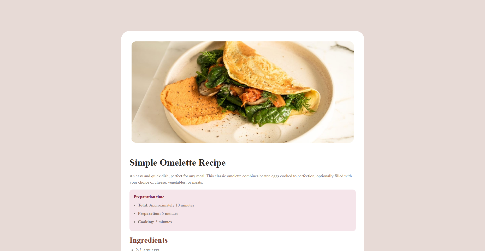

# Frontend Mentor - Recipe page solution

This is a solution to the [Recipe page challenge on Frontend Mentor](https://www.frontendmentor.io/challenges/recipe-page-KiTsR8QQKm). Frontend Mentor challenges help you improve your coding skills by building realistic projects. 

## Table of contents

- [Overview](#overview)
  - [Screenshot](#screenshot)
  - [Links](#links)
- [My process](#my-process)
  - [Built with](#built-with)
  - [Useful resources](#useful-resources)
- [Author](#author)

## Overview

### Screenshot

### Links

- Solution URL: [solution](https://www.frontendmentor.io/solutions/recipe-page-main-21GkSwTH78)
- Live Site URL: [live site URL](https://your-live-site-url.com)

## My process

### Built with

- Semantic HTML5 markup
- CSS custom properties
- Flexbox
- CSS Grid
- Mobile-first workflow
- Tailwind
- Git

### Useful resources

- [Tailwind official website](https://tailwindcss.com)

## Author

- Website - [Luis F. Ortega](https://luisortega27.github.io/portfolio/)
- Frontend Mentor - [@LuisOrtega27](https://www.frontendmentor.io/profile/LuisOrtega27)
- Linkedin - [Luis Ortega](https://www.linkedin.com/in/luis-ortega-408127243/)